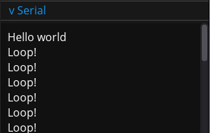

# SMCE-gd  


The official frontend for [libSMCE](https://github.com/ItJustWorksTM/libSMCE).  
Created to emulate cars supporting the [smartcar_shield](https://github.com/platisd/smartcar_shield) platform, write real arduino code and run on it your desktop!

### About
SMCE-gd is an educational platform that allows its users to write real arduino code, levaraging [libSMCE](https://github.com/ItJustWorksTM/libSMCE) to compile and run arduino code to instantly get results without involving real arduino hardware.

Here is a simple arduino hello world program:

```c++
void setup() {
    Serial.begin(9600);
    Serial.println("Hello world");
}

void loop() {
    Serial.println("Loop!");
    delay(100);
}
```

In this world UART is always attached, thus the above will output:



You get access to multiple sensors and other attachments through a simple gui interface, most sensors even display handy information such as what pins they are attached to, and what their actual measurement is:


You get simulated vehicle physics, along with a debug overlay and a keyboard controllable debug vehicle; it is _almost_ true to life.

### Resources

* [Releases](https://github.com/ItJustWorksTM/smce-gd/releases)
* [Setup](https://github.com/ItJustWorksTM/smce-gd/wiki)
* [Capabilities](https://github.com/ItJustWorksTM/smce-gd/wiki/Vehicle-Capabilities)
* [Modding](https://github.com/ItJustWorksTM/smce-gd/wiki/Modding)

* [Smartcar shield](https://github.com/platisd/smartcar_shield) (Examples)

### Development

#### Dependencies

* _[Godot](https://godotengine.org)_
* *_[libSMCE](https://github.com/ItJustWorksTM/libSMCE)_ ([version]([./CMakeLists.txt#L28](https://github.com/ItJustWorksTM/smce-gd/blob/master/CMakeLists.txt#L28)))
* _[godot-cpp](https://github.com/godotengine/godot-cpp)_ (automatically built from source; *_SConstruct_ is **not** used, but _Python3_ is still required)
* C++20-compatible compiler + _[CMake](https://cmake.org)_

\* To install libSMCE head to it's [releases](https://github.com/ItJustWorksTM/libSMCE/releases) page and extract/install one of the artifacts, then set the env var `SMCE_ROOT` pointed to the root of the extracted directory.

#### Building
```shell
mkdir build
cmake -B build
cmake --build build --target godot-smce
```

Packaging is done using _CPack_.  
_note: we bundle the shared lib of SMCE on export_

#### Running

* `godot --path project/`
* Or open up the project folder in the _Godot editor_ and start from there.

### Credits

Copyright ItJustWorks™, Apache 2.0 licensed  

Software courtesy of [RuthgerD](https://github.com/RuthgerD)  
CI & Packaging by [AeroStun](https://github.com/AeroStun)  
Logo by [@Reves.sur.papier](https://instagram.com/reves.sur.papier/)  
Car model by [Ancelin Bouchet](https://github.com/anbouchet)  
